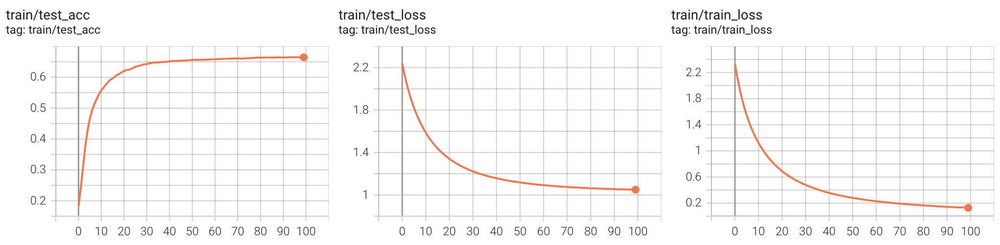
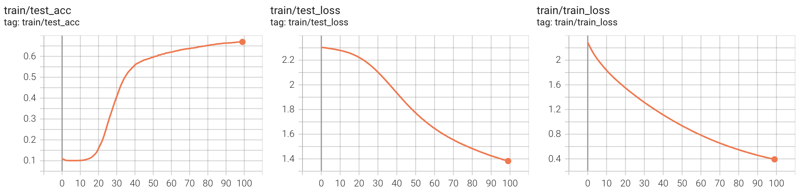
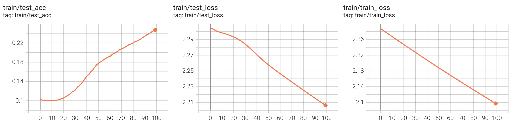
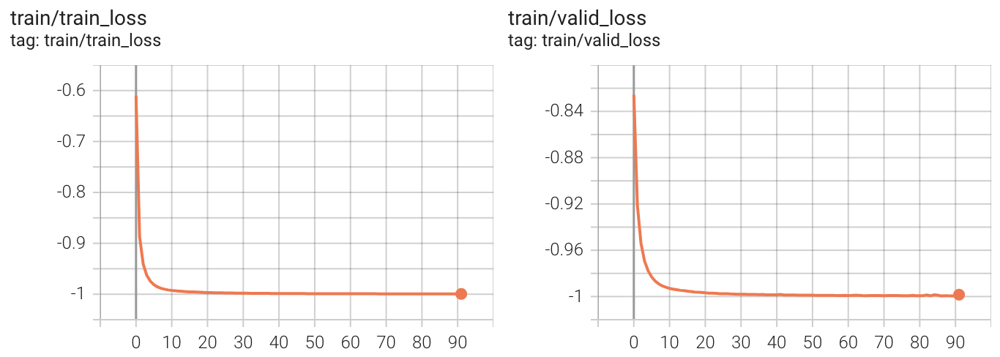
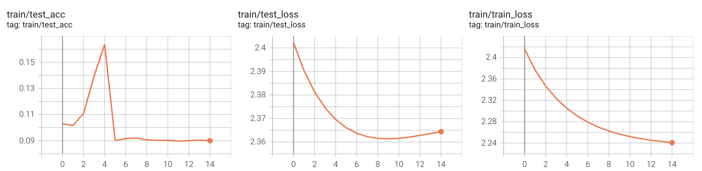
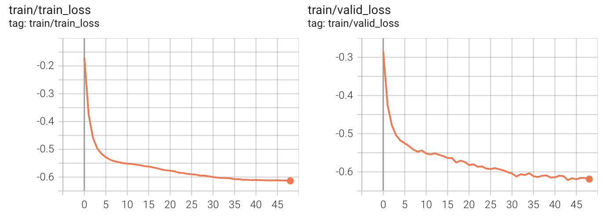
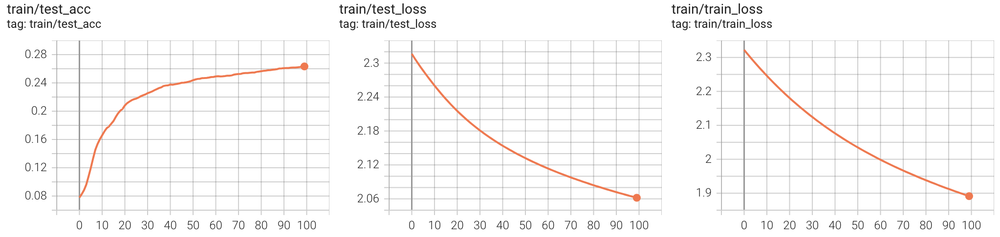

# Result

| Index | Encoder | Freeze | Pretrain | Stopgrad |  Acc   |
| :---: | :-----: | :----: | :------: | :------: | :----: |
|   1   |    0    |   0    |    0     |    0     | 0.6645 |
|   2   |    1    |   0    |    0     |    0     | 0.6692 |
|   3   |    1    |   1    |    0     |    0     | 0.2472 |
|   4   |    1    |   1    |    1     |    0     | 0.0902 |
|   5   |    1    |   1    |    1     |    1     | 0.2633 |

# Encoder_0_Freeze_0_Pretrain_0_Stopgrad_0

## classify

# Encoder_1_Freeze_0_Pretrain_0_Stopgrad_0

## classify

# Encoder_1_Freeze_1_Pretrain_0_Stopgrad_0

## classify

# Encoder_1_Freeze_1_Pretrain_1_Stopgrad_0

## pretrain

## classify

# Encoder_1_Freeze_1_Pretrain_1_Stopgrad_1

## pretrain

## classify
